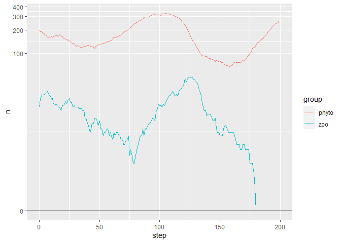

01_plankton
================

## プランクトン生態系モデル

https://mas.kke.co.jp/model/plankton/

### パッケージの読み込み

``` julia
# マルチエージェントシミュレーションのパッケージ
using Agents

# マルチエージェントシミュレーションの動画作成のパッケージ
using InteractiveDynamics
using GLMakie

# データフレーム・データ保存用のパッケージ
using DataFrames
using CSV
```

``` r
library(tidyverse)
```

### プランクトンエージェントの設定

``` julia
# プランクトン
@agent Plankton ContinuousAgent{2} begin
    # プランクトンの種類: phyto (植物プランクトン), zoo (動物プランクトン)
    group::Symbol
    direction::Float64
    power::Union{Int64, Nothing}

    function Plankton(
        id, pos;
        group,
        direction = 2π * rand(),
        power = group == :phyto ? nothing : rand(4:9)
    )
        # 進行角度を進行方向 (x, y方向) に変換
        vel = sincos(direction)

        return new(id, pos, vel, group, direction, power)
    end
end
```

### モデルの初期化関数

``` julia
# 方向転換の関数 (空間作成関数`ContinuousSpace`に入力)
function update_vel!(agent, _)
    if agent.group == :phyto
        # 植物プランクトン
        # プラスマイナス 60 度の範囲でランダムに方向転換
        agent.direction += π / 3. * (rand() * 2. - 1.)
    elseif agent.group == :zoo
        # 動物プランクトン
        # プラスマイナス 30 度の範囲でランダムに方向転換
        agent.direction += π / 6. * (rand() * 2. - 1.)
    end

    agent.vel = sincos(agent.direction)

    return
end
```

    update_vel! (generic function with 1 method)

``` julia

function initialize_model(;
    n_phyto = 200,
    n_zoo = 20,
    extent = (70.0, 70.0)
)
    # 連続空間 (周期的)
    space = ContinuousSpace(
        extent,
        update_vel! = update_vel!
    )

    # モデル作成
    model = ABM(
        Plankton, space,
        scheduler = Schedulers.Randomly()
    )

    # ランダムな位置にエージェントを追加
    # 植物プランクトン
    for _ in 1:n_phyto
        add_agent!(
            model,
            group = :phyto
        )
    end

    # 動物プランクトン
    for _ in 1:n_zoo
        add_agent!(
            model,
            group = :zoo
        )
    end

    return model
end
```

    initialize_model (generic function with 1 method)

### エージェントのステップ関数

``` julia
function agent_step!(agent, model)
    if agent.group == :phyto
        # 植物プランクトン
        # 毎ステップ 0.5 進む
        move_agent!(agent, model, 0.5)

        # 植物プランクトンの増殖
        if rand() < 0.05
            add_agent!(
                agent.pos, model,
                group = :phyto
            )
        end
        
        # 植物プランクトンの死滅 (植物プランクトンが周囲1以内に4以上存在すると死ぬ)
        agents_nearby = nearby_agents(agent, model, 1)
        
        n_phyto_nearby = 0
        for agent_nearby in agents_nearby
            if agent_nearby.group == :phyto
                n_phyto_nearby += 1
            end
        end
        
        if n_phyto_nearby >= 4
            kill_agent!(agent, model)
            return
        end
    elseif agent.group == :zoo
        # 動物プランクトン
        # 毎ステップ 2 進む
        move_agent!(agent, model, 2.)
        
        # 毎ステップ 体力が 1 減る
        # 体力に合わせて死滅する
        agent.power -= 1
        if agent.power * rand() <= 0.2
            kill_agent!(agent, model)
            return
        end

        # 植物プランクトンを探して捕食する (kill_agent!)
        # 捕食すると体力が 3 回復する
        agents_nearby = nearby_agents(agent, model, 2)

        for agent_nearby in agents_nearby
            if agent_nearby.group == :phyto
                kill_agent!(agent_nearby, model)
                agent.power += 3
                break
            end
        end
        
        # 体力が 10 以上だと繁殖する (体力を 4 消費する)
        if agent.power >= 10
            daughter = add_agent!(
                agent.pos, model,
                group = :zoo,
                power = 4
            )
            agent.power -= 4
        end
    end

    return
end
```

    agent_step! (generic function with 1 method)

### プランクトンの個体数の変化

``` julia
model = initialize_model()
```

    AgentBasedModel with 220 agents of type Plankton
     space: periodic continuous space with (70.0, 70.0) extent and spacing=3.5 with velocity updates
     scheduler: Agents.Schedulers.Randomly

``` julia
agent_df, _ = run!(
    model, agent_step!, 200,
    adata=[:group]
)
```

    (37750×3 DataFrame
       Row │ step   id     group
           │ Int64  Int64  Symbol
    ───────┼──────────────────────
         1 │     0      1  phyto
         2 │     0      2  phyto
         3 │     0      3  phyto
         4 │     0      4  phyto
         5 │     0      5  phyto
         6 │     0      6  phyto
         7 │     0      7  phyto
         8 │     0      8  phyto
       ⋮   │   ⋮      ⋮      ⋮
     37744 │   200   2166  phyto
     37745 │   200   2167  phyto
     37746 │   200   2168  phyto
     37747 │   200   2169  phyto
     37748 │   200   2170  phyto
     37749 │   200   2171  phyto
     37750 │   200   2172  phyto
                37735 rows omitted, 0×0 DataFrame)

``` julia

dir_plankton = "01_plankton"
```

    "01_plankton"

``` julia
file_plankton = dir_plankton * "/agent_df.csv"
```

    "01_plankton/agent_df.csv"

``` julia

isdir(dir_plankton) || mkdir(dir_plankton)
```

    true

``` julia
CSV.write(file_plankton, agent_df)
```

    "01_plankton/agent_df.csv"

``` r
agent_df <- read_csv("01_plankton/agent_df.csv",
                     col_types = cols(step = "i",
                                      id = "i",
                                      group = "f")) 

agent_df |> 
  count(step, group) |> 
  complete(step, group,
           fill = list(n = 0)) |> 
  ggplot(aes(step, n,
             color = group)) +
  geom_line() +
  geom_hline(yintercept = 0) +
  scale_y_continuous(trans = "log1p")
```



``` julia
agent_color(agent) = agent.group == :phyto ? :green : :red
```

    agent_color (generic function with 1 method)

``` julia
abmvideo(
    "01_plankton.mp4", model, agent_step!;
    ac = agent_color,
    frames = 200,
    framerate = 20
)
```

[01_plankton.mp4](01_plankton.mp4)
